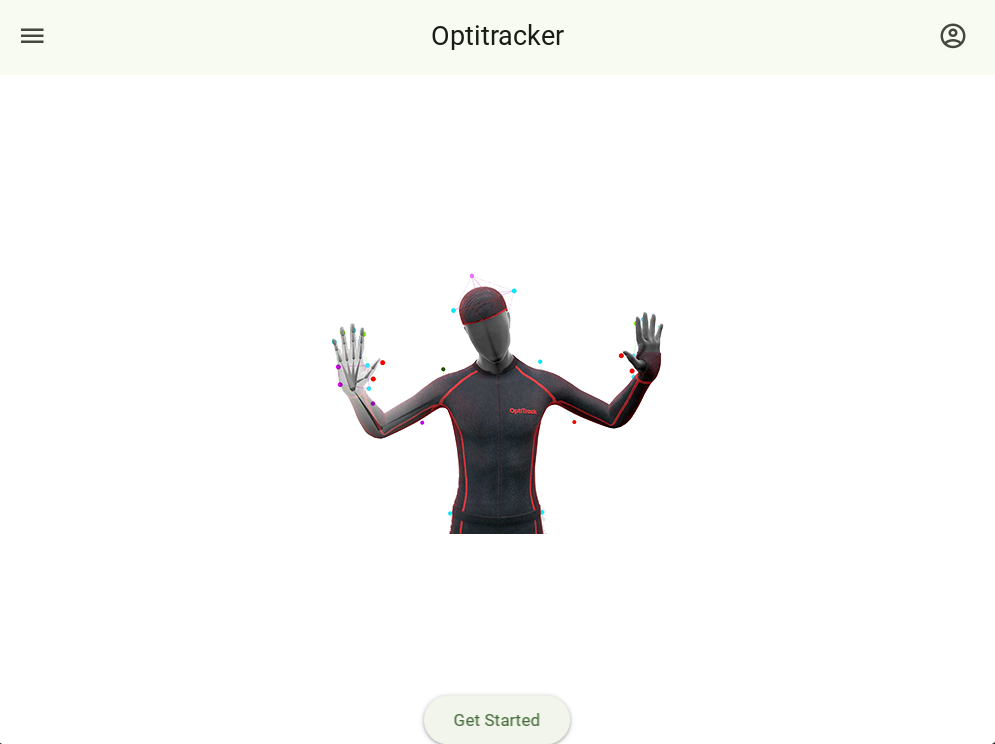

# Computer Vision based focus assistant

### Plan

Have the 2 facial points only (the pupil and the eye map(boundary))

During calibration store the distances between the eye boundaries and the pupil landmark, and give some relaxation (and apply conditional statements)

### Temporary Problems:

Facial landmark itself is an object (How to print it?)
